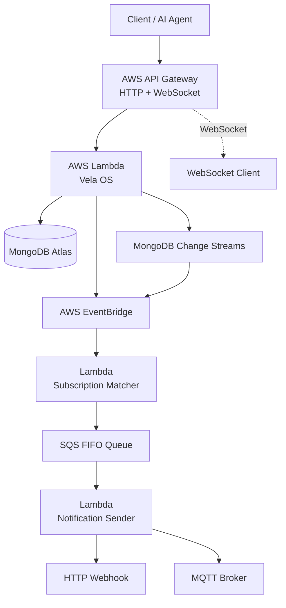
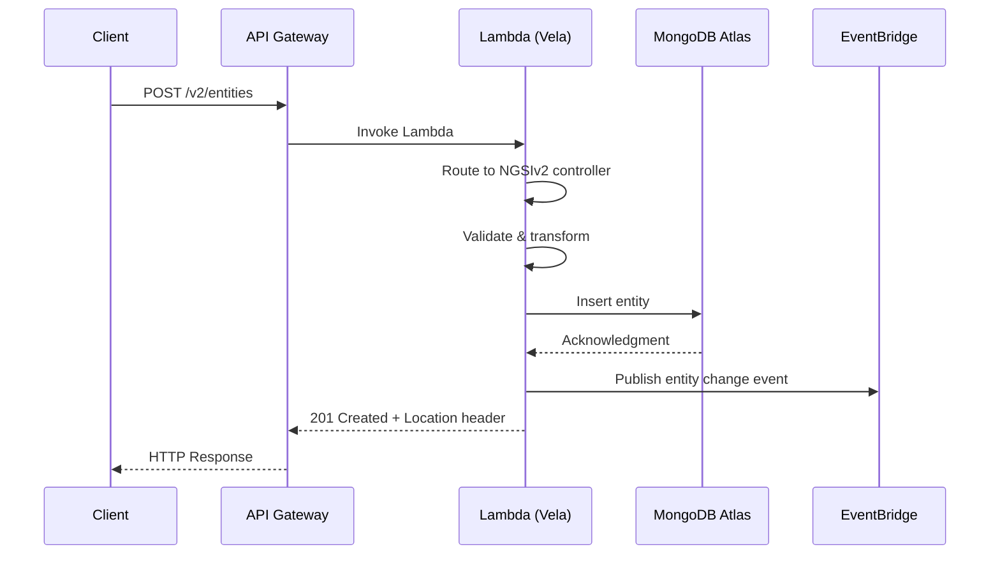
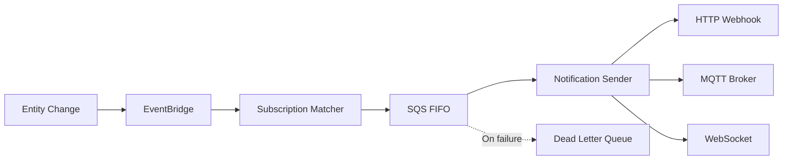

# Architecture

Vela OS is a serverless application built on AWS managed services. This page describes the overall system architecture, request flow, and source code structure.

## System Overview



### Components

| Component | Service | Purpose |
|-----------|---------|---------|
| **API Handler** | AWS Lambda | Processes all NGSI API requests (CRUD, queries, subscriptions, registrations) |
| **API Gateway** | AWS API Gateway | HTTP routing, WebSocket connections, request validation |
| **Database** | MongoDB Atlas | Entity storage, time series collections, tenant isolation |
| **Event Bus** | AWS EventBridge | Decouples entity changes from subscription processing |
| **Subscription Matcher** | AWS Lambda | Matches entity changes against subscription conditions |
| **Notification Queue** | SQS FIFO | Ordered, reliable notification delivery |
| **Notification Sender** | AWS Lambda | Delivers notifications via HTTP, MQTT, or WebSocket |
| **Change Streams** | MongoDB Change Streams | Real-time detection of database changes |

## Request Flow

A typical API request follows this path:



1. **API Gateway** receives the HTTP request and invokes the Lambda function
2. The **Lambda handler** routes the request to the appropriate API controller (NGSIv2 or NGSI-LD)
3. The **controller** validates input and calls the service layer
4. The **service** executes business logic and interacts with MongoDB through the repository layer
5. **Transformers** convert between API-specific formats and the internal entity representation
6. On write operations, an event is published to **EventBridge** for subscription processing

## Subscription Notification Flow



- **EventBridge** receives entity change events from the API handler
- The **Subscription Matcher** Lambda evaluates all matching subscriptions (entity type, attributes, query conditions, geo-conditions)
- Matching notifications are queued in **SQS FIFO** for ordered delivery
- The **Notification Sender** delivers via HTTP webhook, MQTT, or WebSocket
- Failed notifications are sent to a **Dead Letter Queue** for retry/inspection

## Source Code Structure

```
src/
├── api/                 # HTTP layer
│   ├── ngsiv2/          # NGSIv2 API (routes, controllers, transformers)
│   ├── ngsild/          # NGSI-LD API (routes, controllers, transformers)
│   ├── catalog/         # Data catalog API (DCAT-AP / CKAN)
│   ├── mcp/             # MCP server and AI tools
│   ├── admin/           # Admin API (tenant/user management)
│   ├── auth/            # Auth API (login, token management)
│   └── shared/          # Middleware, error handling, common controllers
├── core/                # Business logic
│   ├── entities/        # Entity CRUD, queries, repository
│   ├── subscriptions/   # Subscription management and matching
│   ├── registrations/   # Context source registrations
│   ├── federation/      # Distributed query forwarding
│   ├── geo/             # Geo-queries, spatial ID (ZFXY)
│   ├── catalog/         # Data catalog service
│   ├── cadde/           # CADDE connector
│   ├── auth/            # Auth services (JWT, RBAC, XACML, OIDC)
│   ├── temporal/        # Temporal API (time series)
│   ├── tiles/           # Vector tile generation
│   ├── snapshots/       # Entity snapshots
│   └── metrics/         # API usage metrics
├── handlers/            # Lambda entry points
│   ├── api/             # Main API handler
│   ├── streams/         # Change stream processor
│   └── subscriptions/   # Subscription matcher and notifier
└── infrastructure/      # External service clients
    ├── mongodb/         # MongoDB client and connection
    ├── eventbridge/     # AWS EventBridge client
    └── mqtt/            # MQTT client for notifications
```

### Layer Responsibilities

| Layer | Directory | Responsibility |
|-------|-----------|---------------|
| **API** | `src/api/` | HTTP routing, request validation, response formatting, format transformation |
| **Core** | `src/core/` | Business logic, data validation, domain rules |
| **Handlers** | `src/handlers/` | Lambda entry points, event processing |
| **Infrastructure** | `src/infrastructure/` | External service clients (MongoDB, EventBridge, MQTT) |

### Key Design Patterns

- **Unified Internal Format** — Both NGSIv2 and NGSI-LD convert to/from a common internal entity structure, enabling seamless cross-API access
- **Tenant Isolation** — The `Fiware-Service` header determines the tenant. Data is fully isolated at the database level
- **Federation** — Context providers registered via `/v2/registrations` or `/ngsi-ld/v1/csourceRegistrations` handle queries for remote entities with loop detection
- **Transformer Pattern** — API-specific transformers handle the conversion between wire format and internal format in both directions

## Database Design

MongoDB Atlas stores data with tenant isolation:

- Each tenant's entities are stored in a dedicated collection (based on `Fiware-Service` header)
- **Time Series Collections** are used for temporal data, leveraging MongoDB's native time series support for efficient storage and aggregation
- **TTL indexes** enforce data retention policies
- **2dsphere indexes** enable geo-spatial queries
- **Change Streams** detect real-time entity modifications for subscription processing

## Next Steps

- [Quick Start](/en/introduction/quick-start) — Make your first API call
- [First Entity Tutorial](/en/getting-started/first-entity) — Step-by-step entity CRUD walkthrough
- [API Reference](/en/api-reference/ngsiv2) — Full NGSIv2 API documentation
