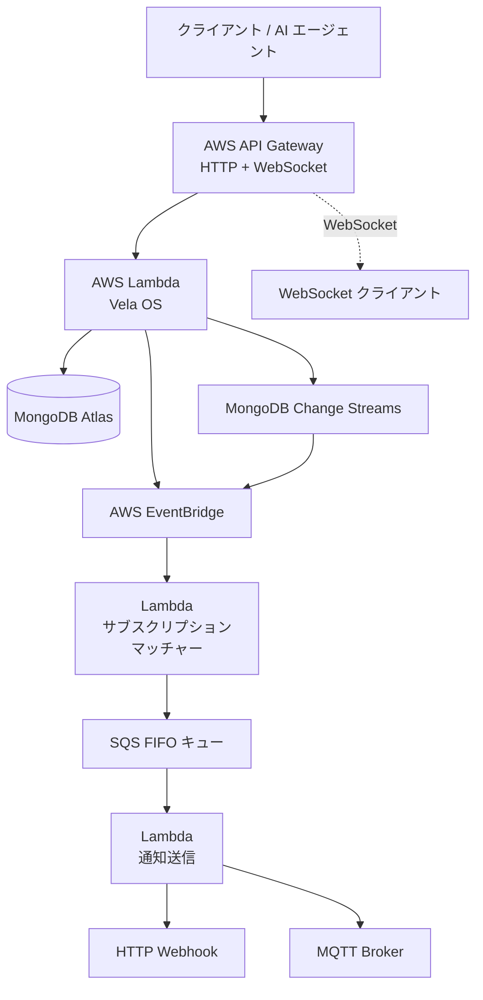
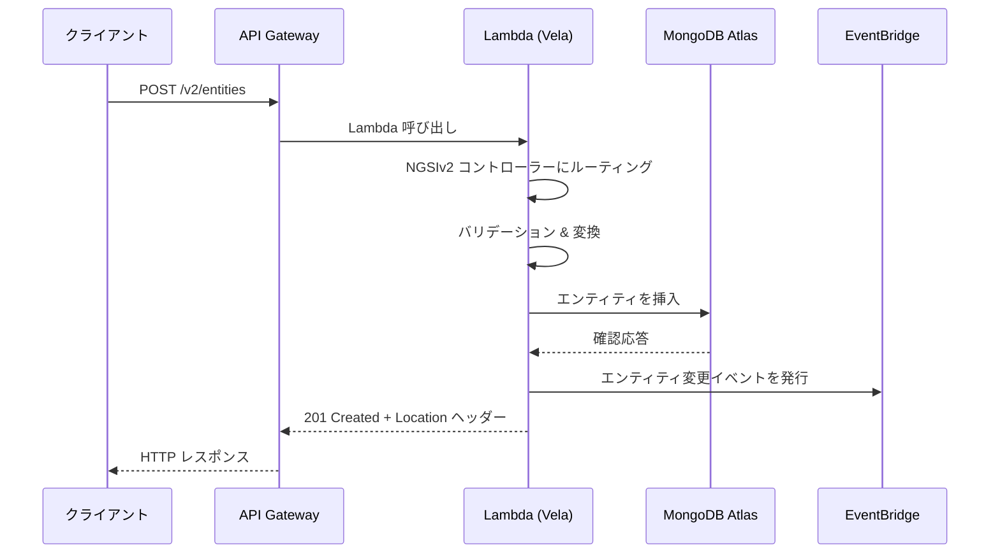
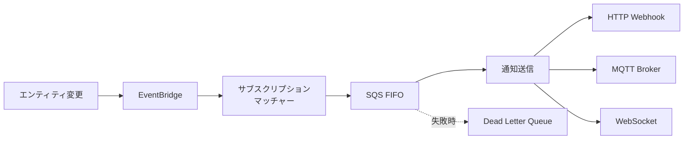

# アーキテクチャ

Vela OS は AWS マネージドサービス上に構築されたサーバーレスアプリケーションです。このページでは、システム全体のアーキテクチャ、リクエストフロー、ソースコード構造を説明します。

## システム概要



### コンポーネント

| コンポーネント | サービス | 役割 |
|--------------|---------|------|
| **API ハンドラー** | AWS Lambda | すべての NGSI API リクエスト（CRUD、クエリ、サブスクリプション、登録）を処理 |
| **API Gateway** | AWS API Gateway | HTTP ルーティング、WebSocket 接続、リクエストバリデーション |
| **データベース** | MongoDB Atlas | エンティティストレージ、時系列コレクション、テナント分離 |
| **イベントバス** | AWS EventBridge | エンティティ変更とサブスクリプション処理の非同期連携 |
| **サブスクリプションマッチャー** | AWS Lambda | エンティティ変更をサブスクリプション条件と照合 |
| **通知キュー** | SQS FIFO | 順序保証された信頼性の高い通知配信 |
| **通知送信** | AWS Lambda | HTTP、MQTT、WebSocket 経由で通知を配信 |
| **Change Streams** | MongoDB Change Streams | データベース変更のリアルタイム検出 |

## リクエストフロー

典型的な API リクエストは以下の流れで処理されます：



1. **API Gateway** が HTTP リクエストを受信し、Lambda 関数を呼び出す
2. **Lambda ハンドラー**が適切な API コントローラー（NGSIv2 または NGSI-LD）にルーティング
3. **コントローラー**が入力を検証し、サービス層を呼び出す
4. **サービス**がビジネスロジックを実行し、リポジトリ層を通じて MongoDB とやり取り
5. **トランスフォーマー**が API 固有のフォーマットと内部エンティティ表現の間で変換
6. 書き込み操作時は、サブスクリプション処理のために **EventBridge** にイベントを発行

## サブスクリプション通知フロー



- **EventBridge** が API ハンドラーからエンティティ変更イベントを受信
- **サブスクリプションマッチャー** Lambda が全マッチングサブスクリプションを評価（エンティティタイプ、属性、クエリ条件、ジオ条件）
- マッチした通知は順序保証配信のため **SQS FIFO** にキューイング
- **通知送信**が HTTP Webhook、MQTT、または WebSocket で配信
- 失敗した通知はリトライ/調査のため **Dead Letter Queue** に送信

## ソースコード構造

```text
src/
├── api/                 # HTTP レイヤー
│   ├── ngsiv2/          # NGSIv2 API（ルート、コントローラー、トランスフォーマー）
│   ├── ngsild/          # NGSI-LD API（ルート、コントローラー、トランスフォーマー）
│   ├── catalog/         # データカタログ API（DCAT-AP / CKAN）
│   ├── mcp/             # MCP サーバーと AI ツール
│   ├── admin/           # Admin API（テナント/ユーザー管理）
│   ├── auth/            # 認証 API（ログイン、トークン管理）
│   └── shared/          # ミドルウェア、エラーハンドリング、共通コントローラー
├── core/                # ビジネスロジック
│   ├── entities/        # エンティティ CRUD、クエリ、リポジトリ
│   ├── subscriptions/   # サブスクリプション管理とマッチング
│   ├── registrations/   # コンテキストソース登録
│   ├── federation/      # 分散クエリ転送
│   ├── geo/             # ジオクエリ、空間 ID（ZFXY）
│   ├── catalog/         # データカタログサービス
│   ├── cadde/           # CADDE コネクタ
│   ├── auth/            # 認証サービス（JWT、RBAC、XACML、OIDC）
│   ├── temporal/        # Temporal API（時系列）
│   ├── tiles/           # ベクトルタイル生成
│   ├── snapshots/       # エンティティスナップショット
│   └── metrics/         # API 使用メトリクス
├── handlers/            # Lambda エントリーポイント
│   ├── api/             # メイン API ハンドラー
│   ├── streams/         # Change Stream プロセッサ
│   └── subscriptions/   # サブスクリプションマッチャーと通知送信
└── infrastructure/      # 外部サービスクライアント
    ├── mongodb/         # MongoDB クライアントと接続
    ├── eventbridge/     # AWS EventBridge クライアント
    └── mqtt/            # 通知用 MQTT クライアント
```

### レイヤーの責務

| レイヤー | ディレクトリ | 責務 |
|---------|------------|------|
| **API** | `src/api/` | HTTP ルーティング、リクエスト検証、レスポンスフォーマット、フォーマット変換 |
| **Core** | `src/core/` | ビジネスロジック、データ検証、ドメインルール |
| **Handlers** | `src/handlers/` | Lambda エントリーポイント、イベント処理 |
| **Infrastructure** | `src/infrastructure/` | 外部サービスクライアント（MongoDB、EventBridge、MQTT） |

### 主要な設計パターン

- **統一内部フォーマット** — NGSIv2 と NGSI-LD の両方が共通の内部エンティティ構造との変換を行い、シームレスなクロス API アクセスを実現
- **テナント分離** — `Fiware-Service` ヘッダーがテナントを決定。データベースレベルで完全に分離
- **フェデレーション** — `/v2/registrations` または `/ngsi-ld/v1/csourceRegistrations` で登録されたコンテキストプロバイダーがリモートエンティティのクエリを処理（ループ検出付き）
- **トランスフォーマーパターン** — API 固有のトランスフォーマーがワイヤーフォーマットと内部フォーマット間の双方向変換を処理

## データベース設計

MongoDB Atlas はテナント分離でデータを保存します：

- 各テナントのエンティティは専用コレクションに保存（`Fiware-Service` ヘッダーに基づく）
- **Time Series Collections** を時系列データに使用し、MongoDB ネイティブの効率的なストレージと集計を活用
- **TTL インデックス**によるデータ保持ポリシーの適用
- **2dsphere インデックス**によるジオスペーシャルクエリの実現
- **Change Streams** によるサブスクリプション処理のためのリアルタイム変更検出

## 次のステップ

- [クイックスタート](/ja/introduction/quick-start) — 最初の API コールを試す
- [はじめてのエンティティ](/ja/getting-started/first-entity) — エンティティ CRUD のステップバイステップガイド
- [API リファレンス](/ja/api-reference/ngsiv2) — NGSIv2 API の完全なドキュメント
